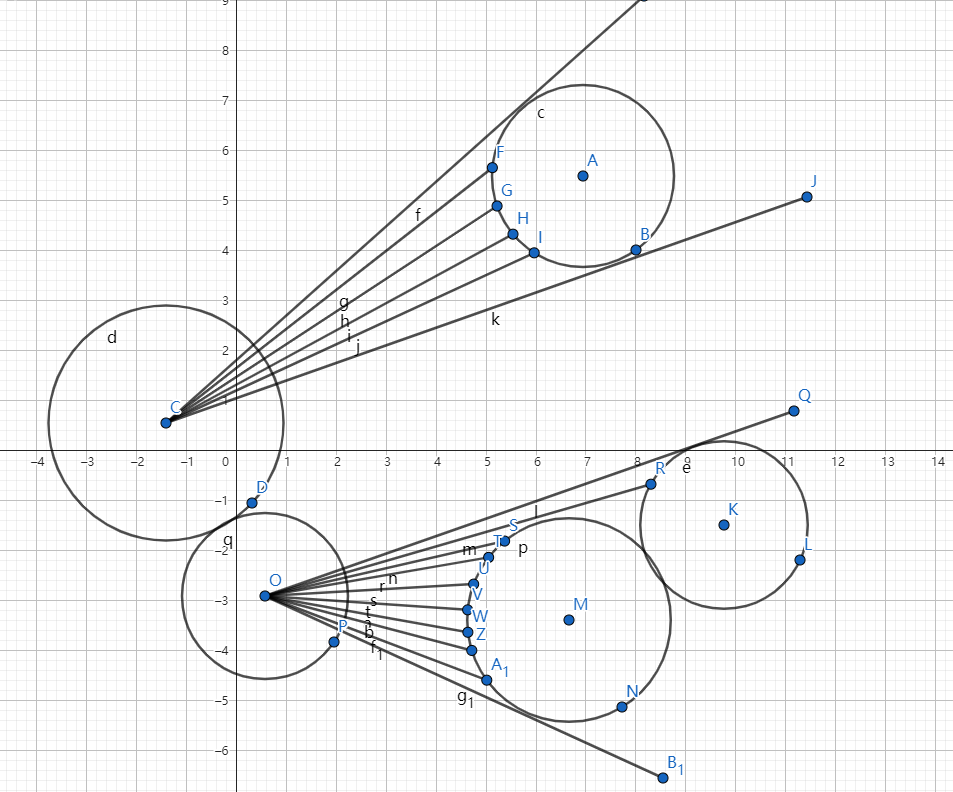
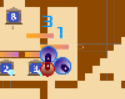
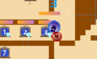
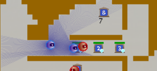

# 调度（待修改）

当工作台A的产品格堵塞，且到达A后A的产品格物品不能送出，则先不送A产品格的最后一个物品
否则， 只有到达A后发现A的产品可以送出去则送A


目前的问题：连续造了2个6，而没有均衡去造456，存在很大的问题

7送满一套再送7，456立即送


$pp[i][j]$工作台$i$的产品是否可以卖给工作台$j$ 


有能够生产的类型7工作台：

阶段1：送123到456

考虑到造7的问题，需要均衡456的制造个数。

令$num456_i$为生产出的（包括即将生产的）且没有卖给$9$的产品$i(4\le i\le 6)$的个数。

制作$num456_i$越小的产品应具有越高的优先级。


阶段2：送456到7

阶段3：送7到89


没有能够生产的类型7工作台：


经过7工作台却没卖7。

# 避让（未完成）

**每次需要给每个机器人寻找一个局部导航，机器人根据导航进行移动**
设机器人起点为p
导航每次给出一个目标点nextTo
表示机器人下一步直线运动到nextTo

雷达信息：
根据(p,nextTo)可以造出一个矩形

<p align="center">
     <br />
</p>

机器人半圆的雷达探测终点不能在矩形内


**~~判断机器人不可移（被夹住）：**~~

~~机器人不存在一个合法的矩形运动区域（枚举360度方向，或者枚举周围格子进行判定）~~

~~方案失败，矩形区域没法判断机器人转弯可以走多远，**采用格子地图**~~

~~当被夹住后，让它保持最高优先级至少C帧~~

被夹住后，转为demoMove模式（**待完成**）


避让操作：

先找出所有不可移动机器人，其它机器人需要避让这些不可移动机器人

对于其它机器人，按物品价值/距离进行从大到小进行排序，排在后的机器人需要避让排在前的机器人


避让规则：

预估前面的机器人想要走的路径，其它机器人的终点需要避开这条路径

# TODO

蓝色直接撞，红色避对面

发现手上物品超出预计送达时间过长，直接放弃物品（**待完成**）


进攻：

​	找一条比较窄的路径，反复横跳（**待完成**）：

​			路径特征：周围工作台较多，路径较窄，能够有效堵着对方


A*（**待完成**）

设定一个时间阈值t，首先按优先级排序，预测己方机器人在t时间内的轨迹，按顺序求己方机器人路径


**雷达给工作台加一个预计堵住时间**，雷达检测到是空的，删除工作台堵塞状态（**待完成**）


增加一个机制，检测敌方策略是追着我方走，还是只占领工作台，如果是追着我方走，可以诱导其运动，如果是只占领工作台，需要切换目标（**待完成**）。

目标工作台切换机制（**待完成**）

# 敌方位置估计（有任务待完成）

<p align="center">
     <br />
</p>

如果雷达的射线正常照射到障碍物或者己方机器人，则该射线称为正常射线，否则称为异常射线

根据异常射线照出的三个点，可以三点定圆求出敌方机器人信息，需要判定机器人信息的合法性：

​				三点定圆求出的机器人信息半径要么为0.53，要么为0.45，如果都不是则不合法（已完成）


可以根据三个不同机器人照射到的点确定敌方机器人位置（**待完成**）

# 地图类型判断（已完成）

没有蓝色工作台：类型$4$

有蓝色工作台：

​			红蓝区域不联通：类型$2$

​			红蓝区域联通：

​					定义一个点是窄的，当且仅当下面条件满足：

​								以这个点为中心能容纳一个半径为0.53的机器人

​								设$d_1,d_2,d_3,d_4$为这个机器人往上下左右进行雷达探测得到的距离，其中至少有$2$个$< 1.06$米

​	 				设定一个阈值$T$，当窄点的数量$<T$，则判定为类型$1$，否则判定为类型$3$
# 进攻型机器人设定（已完成，待进一步优化）

首先检查能否干扰附近的敌方机器人，如果能直接干扰

否则需要给进攻型找到一个目标工作台，目标工作台是敌方的7/8/9类型工作台，每过一定的时间给其切换一个目标

#  机器人执行进攻任务（有任务待完成）

地图类型1：不考虑进攻

地图类型2（已完成）：

​				  一个进攻型机器人

​				  在一个敌方工作台附件等待，当有敌方机器人前来，考虑跟其对撞

​				  围绕一个对方的7/8/9号工作台转圈，可能需要根据雷达信息估计一下敌方机器人去哪个工作台	


​				  在一些敌方的7/8/9工作台附近游走，检测附近的机器人状态，如果有敌方机器人前来，直接跟其对撞

​				  

地图类型3（已完成）：

​				  一个进攻型机器人，直接前往地方基地

​				  在一个敌方工作台附近等待，当有敌方机器人前来，考虑跟其对撞

​				 

地图类型4（类型23的策略可直接应用过来，待进一步优化）：

​				   四个进攻型机器人


定义一个敌方工作台的密集度为它r范围内的机器人工作台数量，找一个密集度最高的工作台（在此基础上编号最大）,如果敌方机器人逃跑了，则回到密集区域**（待完成）**

~~机器人带一个1/2/3物品再去骚扰敌人（**待完成**）~~

# 问题（待完成）

<p align="center">
     <br />
</p>

机器人挪得慢（**待解决**）

# 机器人转换(待完成)

当发现机器人取不到任务，直接转换为攻击型机器人

# 目标工作台切换机制（**已完成**）

为每个工作台记录一个序列hisMinDis

hisMinDis[i]表示i时刻雷达检测到的敌方机器人距离该工作台的最近距离

hisMinDis[i]=-1表示i时刻的信息未知

根据hisMinDis，判断当前时刻每个工作台是否是安全的，如果是安全的，则可以送往这个工作台，否则需要切换目标工作台

如何判断目标工作台是否安全：

​			从当前时间算起，如果连续K次检测到hisMinDis<=DisLim，则认为工作台是不安全的，否则认为是安全的，不安全则需要切换送的工作台

#  物品长期不能送达，unlock对应工作台，机器人进入持有物品但无目标状态（**已完成**）v19

当机器人持有物品，并发现机器人长期速度为0，则解锁对应工作台 

# 为机器人记录hisvelocity，用于判断是否死锁，并加入解除死锁机制（有bug待修复）v17

# 运输机器人避开敌方攻击机器人（已完成）

定义一个攻击型机器人是攻击状态：

​				当这个机器人正前方有一个机器人，距离他很近（已经碰撞了）

定义一个运输型机器人是防御状态：

​				当这个机器人正前方有一个机器人，距离他很近（已经碰撞了）

当运输型机器人被攻击，需要速度加大最大并转向避开攻击

# BUG

getEvalDis

   if (e.velocity.len() <= EPS)

​    continue;

浮点运算要用std::abs不能直接用abs，否则在Linux上会调用abs(int)（C语言函数），或者用浮点都用fabs

updTask6 maxScore=0未修复，应该是maxScore=-1e9 


vis机制与机器人切换目标机制冲突，机器人很难到达工作台，但占用了它的wait机制

<p align="center">
     <br />
</p>

往加r.isTransPorter()    (v27发现)

# 空旷工作台附近有敌人，直接全速前进（**待完成**）

敌人站在空旷工作台附近，阻止我方卖物品，此时我方机器人全力一击可破解

# 紧急任务

<p align="center">
     <br />
</p>

自己卡住自己（**非常紧急，T0任务**，好像可以Ev=max(Ev,0.1)）

~~机器人带一个1/2/3物品再去骚扰敌人（已完成）~~ v15

~~定义一个敌方工作台的密集度为它r范围内的机器人工作台数量，找一个密集度最高的工作台（在此基础上类型最大）,如果敌方机器人逃跑了，则回到密集区域（已完成）~~ v14

~~目标工作台切换机制（已完成）~~ v16

~~A*（**待完成**）~~

~~修改调度（**待完成**）~~

地图类型判断测试更多地图，自己制作地图（**待完成**）

~~为机器人记录hisvelocity，用于判断是否死锁，并加入解除死锁机制（已完成）~~v17

工作台找任务，工作台从大到小，首先判定工作台的物品是不是急需卖出，如果是，给它分配最优机器人（**待完成**）

类型3如果发现敌方有较多机器人来攻击我方，变得堵塞起来，则化守为攻，转换一个或多个运输型机器人为攻击型机器人（**待完成**）

**启用了wait机制后，机器人接不到新的任务会在工作台站着不动而一直占用工作台的问题**（**待完成**）

速度调节：如果顶着对面后退，需要减速（**待完成**）

wait机制：

对图3非常有效，但当有敌人来干扰时，更容易造成堵塞（**待完成**）

最后1000帧尝试把攻击型机器人的物品卖出去（**待完成**）

观察敌方工作台状态，决定用几个机器人（**待完成**）


bfs写法可以正常运行，但需要进一步优化。

我们有一个人被顶了之后，如果出不来，应该把他手上的任务放弃掉（**待完成**）。


<p align="center">
     <br />
</p>

~~检测到敌人要判断可不可达（**待完成**）~~

后退+冲刺撞开敌人（**待完成**）

**攻击型机器人在类型3的图不要远离密集工作台区域**（**待完成**）

**在一个唯一工作台卡人**（**待完成**）

**攻击型机器人根据敌人速度调整自身速度，使得撞击达到平衡**（**待完成**）

当离敌方机器人太近，加速不起来导致撞不开，需要让机器人后退一会再全力冲击（**待完成**）。


swithTask避开了唯一工作台，导致没地方去，考虑能避就避，不能避开就撞。

要判定工作台是否空旷

<p align="center">
     <br />
</p>

# dij树重构

敌方机器人断掉了我方dij树上的边，

<p align="center">
     <br />
</p>

假设断掉这个F

<p align="center">
     <br />
</p>

只需让这个BF相连


基于贪心：

每次拿出dij树里距离最小的点，哪个连通块能与这个点连就连

但是这样带log，需要想办法去log

假设dis估计要走x帧，把对应的dis放到对应的桶里去

它对应的桶里就不排序了


不一定要1帧就重构4个机器人的最短路

可以分4帧或者2帧

改getTarget就可以了

每一帧getTarget检测到对应的线程执行完了

就更新nextTo


```cpp
    // if (rob.isTransporter() && !mp.foes.empty())
    // {
    //   for (auto &f : mp.foes)
    //   {
    //     double angleDis = normAngle(rob.angle - rob.p.angleTo(f.pos));
    //     if (abs(angleDis) <= PI / 3 && rob.p.dis(f.pos) <= rob.radius + f.radius + 0.2)
    //     {
    //       rob.lineSpeed = MAX_FORWARD_SPEED[mp.role];
    //       if (abs(angleDis) <= 0.5 && f.radius >= rob.radius)
    //         rob.angleSpeed = PI;
    //     }
    //   }
    // }    // if (rob.isTransporter() && !mp.foes.empty())
    // {
    //   for (auto &f : mp.foes)
    //   {
    //     double angleDis = normAngle(rob.angle - rob.p.angleTo(f.pos));
    //     if (abs(angleDis) <= PI / 3 && rob.p.dis(f.pos) <= rob.radius + f.radius + 0.2)
    //     {
    //       rob.lineSpeed = MAX_FORWARD_SPEED[mp.role];
    //       if (abs(angleDis) <= 0.5 && f.radius >= rob.radius)
    //         rob.angleSpeed = PI;
    //     }
    //   }
    // }
```

# updInfo

v18 move.cpp 当机器人被撞了，给机器人加速，并转其角度

v16_fix  swithTarget时解除对应工作台申请访问标志 工作台安全性判定修改为0.5

v16_2  当工作台可以被冲击时，不再切换目标工作台。当机器人有物品但运动停止时，unlock对应工作台的标记。依赖版本v16_fix

v16_2_fix 修复canBuy bug，依赖版本v16_2

v16_2_fix_1 类型1蓝方攻击型机器人数量改为1，依赖版本v16_2_fix

v16_2_fix_2 类型1红方攻击型机器人数量改为1，依赖版本v16_2_fix_1 （**机器人updIsStop的bug未修复**）

v16_2_fix_3 当防守型机器人被攻击型机器人撞到后不能动破局，防守机器人增加旋转和最大移速机制，修复机器人updIsStop的bug，依赖版本v16_2_fix_2 

v16_2_fix_2_fixbug 修复机器人updIsStop的bug  ，依赖版本v16_2_fix_2 （**bug修复后效果更差了，暂不修复**）

v21  新增雷达判断是否可以撞到敌人，最后时刻机器人没任务可以化守为攻，依赖版本v16_2_fix_2 

v22  修改了updTaskForTransporter6，防止顺路经过7不卖7，依赖版本v21

v23  增加itemTLE机制，依赖版本v22

v25  更新调度，依赖版本v22

main_v25_imp_fail  失败之作，后退冲撞机制与后退旋转机制，依赖版本v25

main_v26_latest，更新任务调度，使之能适应地图中没有7的情况，依赖版本main_v26_fix

v50，依赖版本v38_updTask_fix_neg_one_bug：

​			工作台unSafe机制更新，新增unSafe帧数设置，并倍增变化

​			移动机制更新

​			工作台访问机制更新，机器人申请访问工作台只能占用100帧

​			进攻型机器人改为直接追着敌人走，不再死守密集工作台（红色机器人守不住）

v51，依赖版本50

​			rushAble类型数量增加为3种

​			runshAble<=1时如果机器人很危险，并且距离工作台近，则不执行购买任务，避免亏钱

​			1：278175,273953

​			2：244466,416684

​			2_p：585783,343222

​			4_p：200000,564809

v52，依赖版本51

​			解锁目标工作台，机器人进入无目标状态

​			机器人stop时旋转前进

​			1：280665,293015

​			2：245629,342343

​			2_p：626328,338890

​			4_p：200000,562678

v51_extend，依赖版本v51：

​			1：273595,246631

​			2：246198,262733

​			2_p：601073,327710

​			4_p：200000,614795

v51_extend1，依赖版本v51_extend：

​			1：274344,249512

​			2：244987,430742

​			2_p：582789,331575

​			4_p：200000,648697


v53，依赖版本52：

​			当一个工作台的fresh_visit机制被连续触发了5次都没有机器人能到达这个工作台，则禁用这个工作台一段时间

​			1：280665,293015

​			2：245629,343764

​			2_p:626328,338890

​			4_p：200000,562678

v53_extend，依赖版本v53：

​			1：272315,232966

​			2：243334,383930

​			2_p：574478,339489

​			4_p：200000,590260


v53_extend2，依赖版本v53_extend：

1：278853,294174

2：248499,357155

2_p：597404,369628

4_p：200000,544230


v53_extend3，依赖版本：v54,v53_extend2

1：275298,276888

2：248499,357155

2_p：597404,369628

4_p：200000,544230


v53_extend3_fix，依赖版本：v53_extend3

1：274507,230853

2：248574,401961

2_p：575805,331868

4_p：200000,609892


v54，依赖版本v53：

​		isStop判断更新

​		1: 280665,293015

​		2：243065,428201

​		2_p：626328,338890

​		4_p：200000,531621


v54_fix，依赖版本v54:

​		修复delTask和swithTask里的调度bug

​		1：280665,293015

​		2：243065,428201

​		2_p：626328,316101

​		4_p：200000,610803

​				  200000,578936（不跳帧，一个3没卖出）

isStop：敌人的速度方向面向着机器人，敌人与机器人的速度非常近，机器人的速度<=0.2


v55，依赖版本：v54_fix

​		A*角度惩罚

​	1：277577,283289

​	2：244469,488173

​	3_p：612733,361318

​	4_p：200000,589256

​		

v??

3_p：583986,343145

4_p：200000,609641


v51：

f2：642322,506129


v55_fix（修复）：

​		v55 main.cpp 1663行double angle = normAngle(atan2(f.velocity.y, f.velocity.x) - f.pos.angleTo(r.p));

​		f1：523876,530622

​		f2：603977,570038


v55_para2：

​	f1：555338,545826

​	f2：617418,604665


v55_para2_cg：

​		修改getWaitDist()，修改wait机制距离问题，mp.getEvalDisNotAngle

 

​	f1：552122,543250

   f2：617418,612258


para3：

547617,562558

637607,579299


D getWaitDist()待修复


v55_fix2：修复getWaitDist()


v55_fix3：修复切换工作台disable机制


# 工作台上的敌方机器人可以被撞开

 如果是这两种形式，则可以直接冲开他

```cpp
/*
.....
..7..
.....

...
...
.7.
...
...


#..#

#...#
#....#

*/
```


# 急转弯提前刹车（未完成）

# 终极目标生产模式

维护一个终极目标列表：在工作台P生产一个并卖出

为了达到工作台P生产出产品的目的，需要给工作台装配原材料，根据工作台P的需求，可以得到计算出每种原料的缺乏数量


对于场上所有的安全工作台

首先计算出所有123工作台到456工作台的估值代价：p,a,b  dis(p,a)+dis(p,b)+

其次计算出所有456工作台到7工作台的估值代价：p,a,b,c dis(p,a)+dis(p,b)+dis(p,c)+val[a]+val[b]+val[c]

对于场上已经完成的456的最多的工作台，优先考虑


目前存在的问题：

456生产不够均衡的问题

为了追求456均衡，前往一个超远的工作台制造456

没有判定456是否可以送达某个7的问题


卖出一个7的收益为完成整个7流程的收益，设为$f_7$，设完成某个$7$的花费时间为$t_7$，希望$f_7/t_7$尽可能大。


两种情况：

1. 需要生产7并卖出
   目前的策略：没有考虑到最终生产哪个7最好，而是找一个最近的7

   首先需要考虑一个7可不可以被生产出来：

   ​			首先计算每个456的可达机器人集合

   ​			如果一个456工作台可以存在一条半径0.53的路径到某个7，则这个7的可达机器人集合或上该工作台的可达机器人集合，同时可以判断出这个7能不能被制作出来

   

   

2. 不需要生产7并卖出（但可以把456物品卖给7工作台）


# 额外采样点

观察yyztest1，还要再额外加一些点才能更加完善


特征：

一个类似于#.....#的入口，下面几行都不是#.....#，CD至少有一个为$.$，Z可以替换为任意字符，格子中心替换为X

两种情况

搜索所有$7*7$的矩形和$5*5$的矩形，如果是下面两种情况，则要将中心设为$X$

```
#.....#
C.....D //距离# 0.25米
C.....D //距离# 0.5米
C..X..D //距离# 0.75米，中心必须为X，才好让半径为0.53的机器人通过
C.....D
C.....D
ZZZZZZZ

#...# 
C...D //距离# 0.25米
C.X.D //距离# 0.5米，中心必须为X，才好让半径为0.45的机器人通过
C...D
ZZZZZ
```

# 任务可完成度估计(未完成)


最后机器人接不到任务让出工作台（**待完成**）

后退冲撞机制（**待完成**）：
		当敌方机器人站在我方空旷工作台不动，阻止我方卖出物品时

​		我方机器人需要在距离该敌人1.5米左右开始全力冲刺，撞开敌人卖出物品

​		敌方机器人站在我方空旷工作台不动判定：plat.isSafe=false

​		后退冲撞机制启用条件：plat.isSafe=false and plat.rushAble=true

​		后退冲撞机制结束条件：我方机器人无法后退到距离敌人1.5米位置（后退过程中给受到任何障碍），或我方物品已卖出

后退旋转机制（**待完成**）

​		触发条件：1.机器人的正前方存在一个敌人，且撞上

​							2.机器人附近存在一个敌人，且机器人无法移动

​							当触发两个条件之一，后退旋转帧数设为C，当C>0，执行后退旋转操作，且C=C-1

​		补充：

​				当敌方机器人在我方空旷工作台不动时，机器人需要撞开它，此时不能触发后退旋转机制

机器人任务解锁工作台（**待完成**）

runable判断有错


调度策略有用到9的可能，需要调权重

搞一个防守策略防守所有同类


# 最终任务


1. ~~地图类型判断（Important）~~

   v27，依赖版本v26_fix

2. ~~工作台让出机制：~~

​			~~机器人没有任务，要离开对应工作台，不能停在工作台，转攻击型机器人需要对面有工作台才能离开，类型2和类型4不会有这种情况，因此可以考虑新建一个虚拟点，当机器人没有目标的时候，让机器人前往这个虚拟点~~

​			~~也可以考虑给机器人设置虚拟目标工作台，到达这个工作台后不做任何事情，继续转往其它虚拟目标~~

​			v28，依赖版本v27

​	3.~~使用1/2个机器人去阻碍别人唯1/2的7号工作台（ 六一儿童节的策略，或任意能阻碍7生产线的工作台）~~

<p align="center">
     <br />
</p>


​			进攻型机器人有两种模式：

​						一种是进攻模式，进攻模式采用当前策略（版本<=v28的策略）

​						一种是防御模式，防御模式用于阻断敌人生产7类物品的生产线。防御模式设计：

​											首先统计敌方1~7工作台的数量，如果能用合适的机器人数量去占领一些敌方工作台，则进入防御模式

​											防御模式每个进攻型机器人有一个防守工作台，当没有敌人靠近这个工作台，则机器人在该工作台上游荡，当敌人距离这个工作台距离<=D，则机器人朝敌人方向进攻，防御模式机器人不能超出它所防守的工作台的一个范围，因为要控制其合理的速度，速度可能超出范围时要注意减速

​		v29，修改canMake7的计算（除了检查7能不能生产出来，同时检查7能不能卖出），全局变量初始化拆分，依赖版本v28

​		v29_fix，修复v29下标使用错误，依赖版本v29

​		v29_fix2，lineSpeed与0.1取max，依赖版本v29_fix

​		v29_fix3，修复函数里复制过来的代码写了return的bug，依赖版本v29_fix2

4. ~~buyItem处修改判断时限：frameID+frame*1.5+delta<=maxFrame~~

   v30，buyItem处解除当前任务，依赖版本v29_fix3

5. ~~修复工作台rushAble的判断~~

   v31，依赖版本v30

   v34，依赖版本v31（getnexttime加入rushAble的判断）

   v34_fixState，修复bug，依赖版本v34

6. ~~地图提前转弯，或转弯提前减速~~

7. 机器人被卡死，想办法脱离卡死

   v36，添加旋转后退机制,依赖版本v35_fixState

8. NextTo找到一个安全位置即可，不必找最远位置（任务跳过）

9. 最后时刻都修改为攻击型机器人（更低的风险，防止买了卖不出去，最后X帧）

10. ~~更新任务调度~~

    v32，mxScore=-1e18，baseCof -= 99999999，依赖版本v31

    v33，canMake7，依赖版本v32

11. 机器人后退再冲刺

    对于蓝方机器人，完全可以将敌人撞开，对于红方机器人，需要找到一个冲刺点

    以工作台为中心，提前撒一些冲击点（各个角度），冲击点可以直线到达该工作台，当机器人发现工作台有敌人，并且距离过近无法冲开时，则先前往冲击点，然后旋转正对着工作台，再全速冲击。

12. ~~附近有敌人全速~~

13. ~~进攻型机器人提前预判好角度~~

    v35_fix，wait机制修改,回退了v34_fix1中修改的v34的机制，依赖版本v34_fix1

    v35_fixState，wait机制修改，v34_fixState

    v35_fixState2，提取了vitualTask，因为updTask6也需要用到，v34_fixState

    v35_fixState3，fxiState修复，v34_fixState2

14. ~~买卖可能跳帧，要根据下次输入修复~~

    v34_fixState，修复bug，依赖版本v34

15. 红色机器人去敌方rushAble=false的工作台

    v38，依赖版本v37_fix

    v38_updTask，任务调度遇到9不是直接continue，防止实在卖不出物品时能卖给9但不卖给9

16. ~~攻击型机器人优先级大于防御型机器人优先级~~

    v34_fix1，依赖版本v34

17. 任务调度切换机制（是切换任务，还是冲击敌人购买，还是冲击敌人售卖）

    对于不可rushAble的工作台，一定是切换任务

    对于可rushAble的工作台，如果是蓝色机器人，不需要切换任务，直接冲击

    如果是红色机器人，先检查切换任务的代价，如果切换任务代价低，直接切换任务，否则尝试冲击，如果冲击失败则切换任务

18. 接不到任务转攻击

19. 机器人被锁死时，解锁对应工作台（待进一步优化）

20. 顺路撞

21. ~~rushAble的工作台不再撒点~~

    v37，依赖版本v36

    v37_fix，fxiState、buyItem、sellItem修复，去除旋转后退机制，依赖版本v37,v35_fixState3

22. 如果工作台距离<=0.1米有敌方机器人，对着敌方机器人中心撞

    v39，依赖版本v38

23. 任务调度距离修复

    v40，依赖版本v37_fix

24. A*对自己机器人也添加惩罚

25. 机器人目标工作台切换机制：

    当机器人手上有物品，但无法卖出时，要给机器人切换卖出的工作台：

    ​			目前只基于工作台不安全且是不可冲的才切换，对于可冲的没有切换机制

    ​			对于可冲的工作台，红色机器人可能被干扰导致卖不出去，这时候需要切换工作台

    ​			

    ​			机制设计：

    ​						如果是蓝色机器人，对于可冲的不安全工作台，优先考虑直接冲过去送，当过了一定时间卖不出再切换工作台

    ​						如果是红色机器人，先计算切换工作台的代价（预计要跑多少帧），如果代价比较低（<=阈值A且<=总时限），否则先冲，加一个变量itemTLE，为期望到达目标工作台的时间-物品持有时间，当itemTLE<=阈值B时，则切换目标工作台

    ​						对于工作台，再加一个变量，lastUnsafe，表示最近的不安全时间是那一帧，在重新分配任务时，为了防止在两个Unsafe的工作台来回切换，切换任务时，优先前往lastUnsafe比较小的，对于frameID-lastUnsafe>=400，都任务lastUnsae是frameID-400

    v41 任务切换机制，依赖版本v38

    v41_zhui 添加追人机制

    v42 修复fresh_visit bug

    v43 调度更新

26. 购买任务时也可以切换

    判断机器人被卡死：

27. 

    ​			

    ​	

    

    

    


卡住的情况：

<p align="center">
     <br />
</p>

( 脑机的做手套的和...)

<p align="center">
     <br />
</p>

（xfzlq_and_qyylx)

<p align="center">
     <br />
</p>

(六一儿童节)

<p align="center">
     <br />
</p>

(JustSoSo)

<p align="center">
     <br />
</p>

(JustSoSo)

<p align="center">
     <br />
</p>

（XD小黑子)

<p align="center">
     <br />
</p>

（XD小黑子)

<p align="center">
     <br />
</p>

（逐星)

<p align="center">
     <br />
</p>

（xfzlq_and_qyylx)

<p align="center">
     <br />
</p>

（xfzlq_and_qyylx)


没有向目标工作台出发

<p align="center">
     <br />
</p>


<p align="center">
     <br />
</p>

（v28 vs v28,4_p)

<p align="center">
     <br />
</p>

（v28 vs v28,2_p)

（启发：能切换目标时，应该切换目标）

占用工作台的让正在wait的先去目标工作台（wait的item>占用工作台的item）

<p align="center">
     <br />
</p>

（v28 vs v29,2)


去工作台，偏好速度不能减速（有敌人不减速）

<p align="center">
     <br />
</p>
